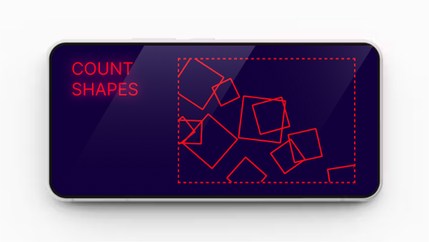

## Replay - kids playboard like UI/UX

Modern text recognition algorithms are capable of recognizing almost the same things as humans. Developing new CAPTCHA technologies is challenging because it is difficult to strike a balance between readability and security. However, text recognition is not the only thing that differentiates humans from computers. Counting the number of geometric shapes in a complex intersecting configuration is another method of distinguishing between humans and computers. This project implements a simple microservice for generating and validating CAPTCHAs that ask users to count the number of randomly placed geometric shapes. Of course, just like text recognition, this method is not completely secure. The advantage lies in the fact that developing a new generation algorithm is much cheaper than developing a recognition algorithm.

### Building

> premake5 gmake2
> cd build \
> make config=release \
> cd ..

### Using

> https://server-name/make

This is a private route to generate a new CAPTCHA ID. You should send this ID to the frontend application in order to generate the image. Why is it necessary to keep this route private? The answer is simple: it is for protection against DoS (Denial of Service) attacks, also because this action temporarily store ids and keys. 

> https://server-name/take/{id}

This is a public route to retrieve the actual image data. No data is stored in memory, and all necessary allocation is performed on the stack.

> https://server-name/test/{id}/{count}

The route simply checks the count supplied by the user against a specific ID. It returns a 200 status code on success and a 401 status code on error. In case of an error, the ID is invalidated and cannot be checked again.

> --canvas=./config.json

This option can be used to supply the configuration of the drawing function. Changes in the configuration file are reloaded without service interruption.